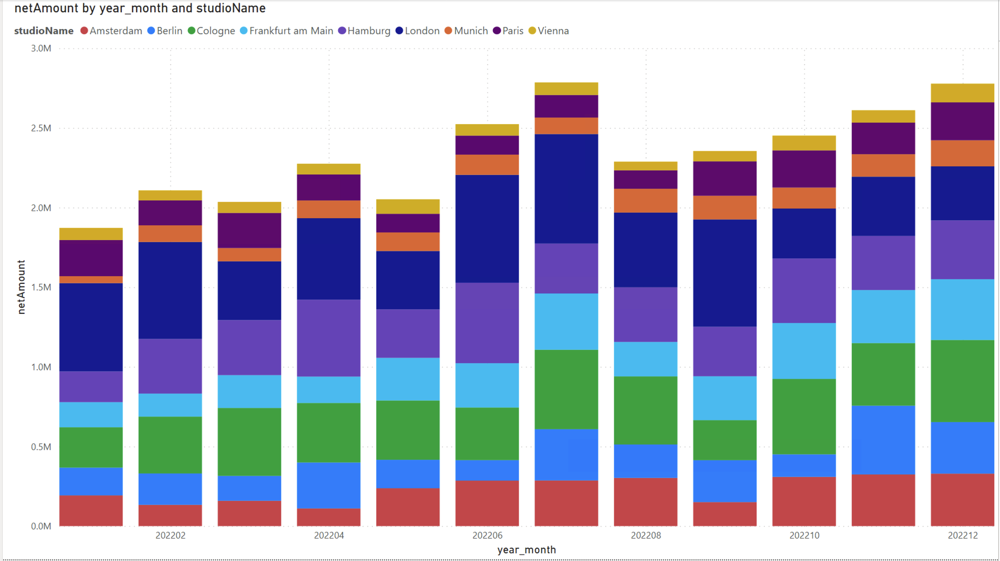

# Power BI on Magicline's Enterprise Data Warehouse

A showcase on reports that can be built with Power BI Desktop connected to 
Magicline's Enterprise Data Warehouse.
See [documentation of Enterprise Data Warehouse](https://data-warehouse-docs.magicline.com/) for more information.

## Get started
1. Download the showcase [report template](powerbi_showcase.pbit) (or any other `.pbit` file).
2. Run using [Power BI Desktop](https://powerbi.microsoft.com/).
3. On opening a warning is displayed, that is due to a parameterized connection setting 
and can be safely ignored. Click `OK`.  
     
4. Enter server and database with the redshift connection information we provided to you. 
Please make sure you are connecting using the static IP address you provided to us!
5. Enter user and password with the Redshift connection information we provided to you.
6. The tables should now be loading and you can explore the showcased reports!

Note: All tables are set up using "Direct Query". But this is not required and you can 
adapt settings and switch their loading mechanism as you wish.

## Showcase

### Revenue
The sum of net accrued revenue by `year_month` and `studio name`, that was made in the 
past year.

### Checkins
The count of checkins by `checkin_date` and `studio name`, that happened in the 
previous 3 months.

### Active Contracts
The count of contracts active (started and not ended yet) in a particular month.
By `year_month`, `studio name` and `type of contract`.

### Contract Cancelations
The count of contract cancelations at their cancelation date. 
By `year_month` and `studio name`.

### Payment Run Amount
The sum of amount in payment runs in the previous 3 months. 
By `year_month` and `booking type`.

### Class Events
The count of class (booking) events in the previous 2 months.
By `year_month`, `class event status` and `studio name`.

